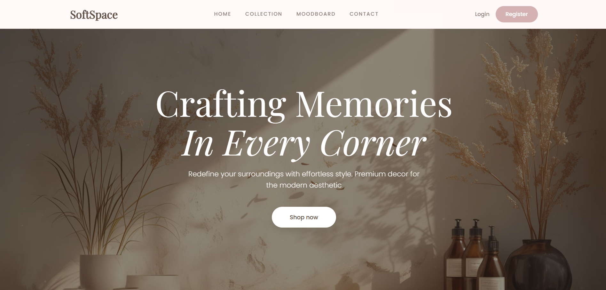
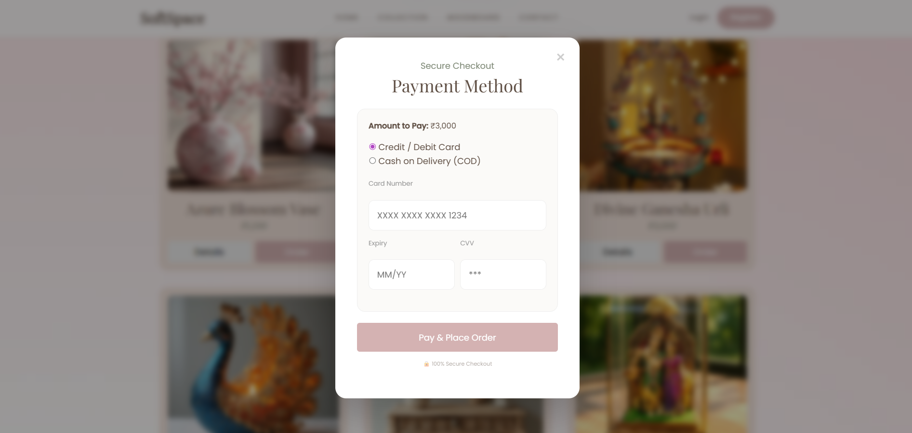
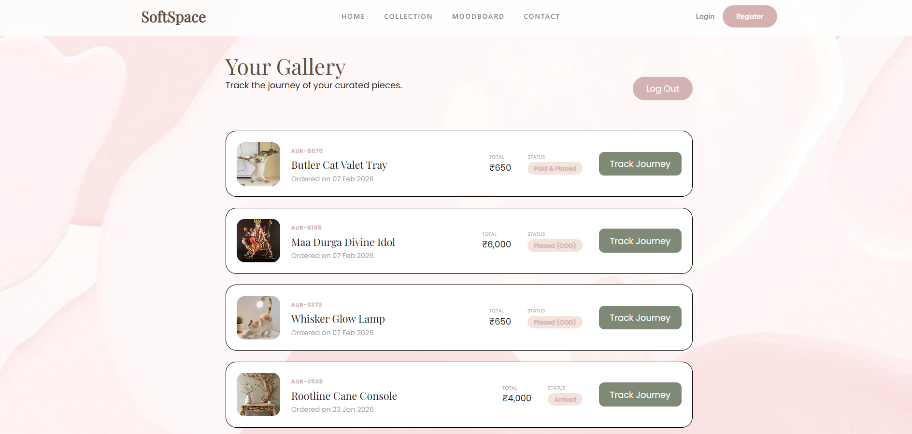

# ✦ SoftSpace —  Home Decor E-Commerce Platform

SoftSpace is a premium, minimalist home decor e-commerce web application built using **ASP.NET Web Forms** and **SQL Server (SSMS)**.  
The project focuses on combining **clean aesthetics** with **non-trivial backend logic**, including authentication, database-driven workflows, and a simulated real-world order tracking system.

This project was built to strengthen full-stack fundamentals such as server-side rendering, state management, and database integration.

---

## Aesthetic & Design Philosophy

- **Color Palette:** Sage Green, Dusty Rose, Warm Cream  
- **Design Goal:** Calm, modern, and luxury-inspired UI  
- **UX Approach:**  
  - Single-page feel using **AJAX (UpdatePanels)**  
  - Seamless modal-based checkout flow  
  - Minimal distractions with focused user journeys  

- **UI Highlights:**  
  - Frosted-glass navigation bar  
  - Full-screen hero section  
  - Centered luxury modals for product details & checkout  
  - Clean, grid-based product presentation  

---

##  Key Features

### 🔐 User Authentication
- Register & Login system
- Regex-based input validation
- Session-based authentication and access control

### 🛍 Dynamic Product Gallery
- Products fetched directly from **SQL Server**
- Data-bound **Repeater** for scalable listings
- Image, price, and description loaded dynamically

### 🧾 Multi-Stage Smart Checkout Flow
1. **Product Discovery** — immersive product detail modal  
2. **Address Validation** — server-side validation for delivery info  
3. **Payment Simulation**  
   - Card payment with basic validation  
   - Cash on Delivery (COD) option  

All stages are handled without full page reloads.

### 📦 Interactive Order Tracking System
- Orders stored permanently in SQL Server
- Visual tracking system with multiple delivery stages
- Status progression displayed using a custom vertical tracker

### ⏳ Session-Based Order Progression (Logic Highlight)
- Each time a user logs in, their existing orders automatically progress:
  - *Placed → In Transit → Out for Delivery → Arrived*
- This simulates the **passage of time** and real-world logistics behavior
- Implemented using a `ProgressLevel (1–4)` stored in the database

---

##  Tech Stack

**Frontend**
- ASP.NET Web Forms (.aspx)
- HTML5, CSS3 (Flexbox & Grid)
- JavaScript (UI animations)

**Backend**
- C# (.NET Framework)
- Code-behind architecture

**Database**
- Microsoft SQL Server (SSMS)

**Data Access**
- ADO.NET

**Asynchronous Handling**
- AJAX / UpdatePanels

**IDE**
- Visual Studio Community 2022

---

##  Screenshots

###  Cinematic Home Page


Full-screen hero section with dynamic product grid.

---

###  Multi-Stage Checkout Flow


Seamless transition from product details → address → payment modal.

---

###  Orders & Tracking System


Card-based order history with a custom visual delivery tracker.

---

## 💾 Database Schema Overview

The application uses **three primary tables**:

- **Users**  
  Stores user credentials and contact information

- **Products**  
  Stores product name, price, description, and image URLs

- **Orders**  
  Links users to products and maintains:
  - Order status
  - ProgressLevel (1–4) for tracking logic

> The actual database connection string is intentionally excluded for security.

---

## ⚙️ Installation & Setup (Local)

### 1. Clone the Repository
```bash
git clone https://github.com/Priyanka-2509/SoftSpace.git
````

### 2. Database Setup

* Open **SQL Server Management Studio (SSMS)**
* Create a database (e.g., `HomeDecorDB`)
* Create required tables (`Users`, `Products`, `Orders`)
* Seed product data if required

### 3. Configure Connection String

* Copy `Web.config.example` → `Web.config`
* Update the `MyDbConn` connection string with your local SQL Server details

### 4. Run the Project

* Open the `.sln` file in Visual Studio
* Press **F5** to run using IIS Express

---

##  Logic Highlight: Order Tracking Engine

Unlike basic CRUD projects, SoftSpace implements a **state-machine style tracking system**.

* A numeric `ProgressLevel` stored in the database controls:

  * Visual progress bar width
  * Active tracking stages
  * Order status text

* A backend hook inside the **Login logic** increments this value automatically, creating a realistic experience where orders advance while the user is away.

This demonstrates:

* Persistent state handling
* Backend-driven UI behavior
* Practical use of database-controlled workflows

---

## Project Status

- Not deployed (runs locally using IIS Express)
- Built for learning, academic evaluation, and portfolio demonstration
- Fully functional with complete authentication, database, and order tracking workflows
- Planned future enhancements include:
  - Live deployment
  - Security improvements (password hashing, role-based access)
  - Migration to a modern architecture (ASP.NET MVC / ASP.NET Core)

---

## 👩‍💻 Author

**Priyanka Kumari**

---

